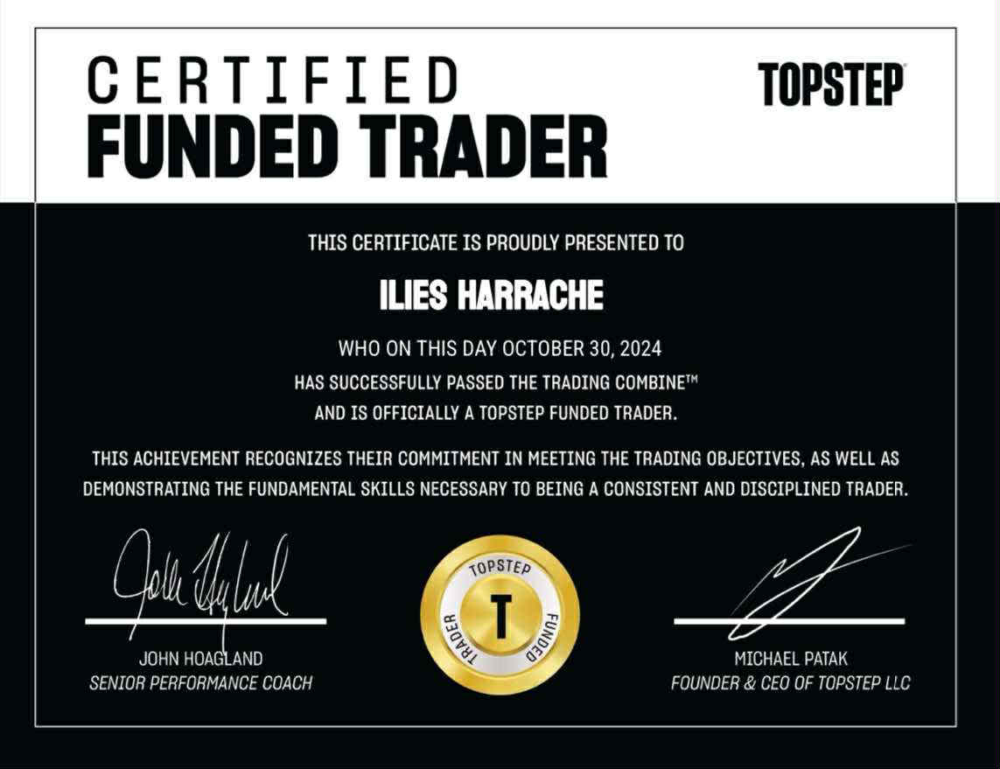
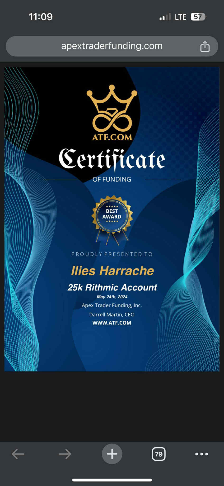
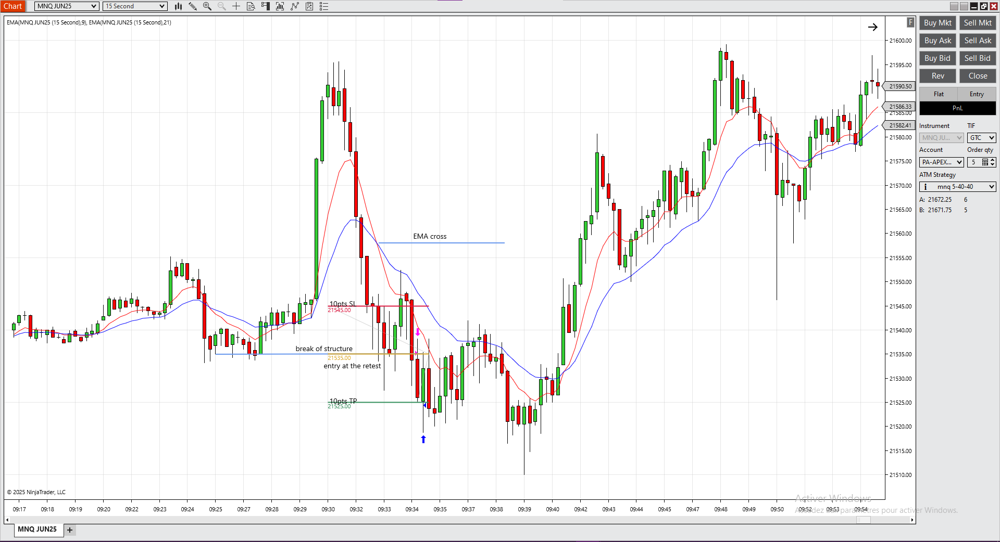
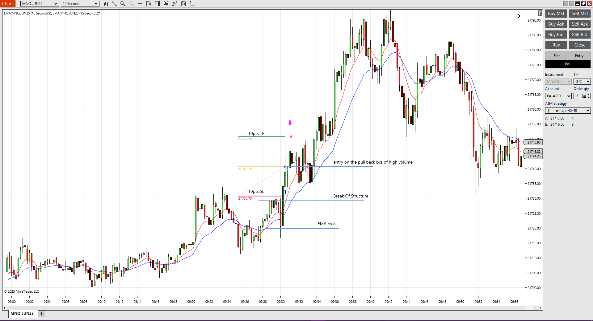
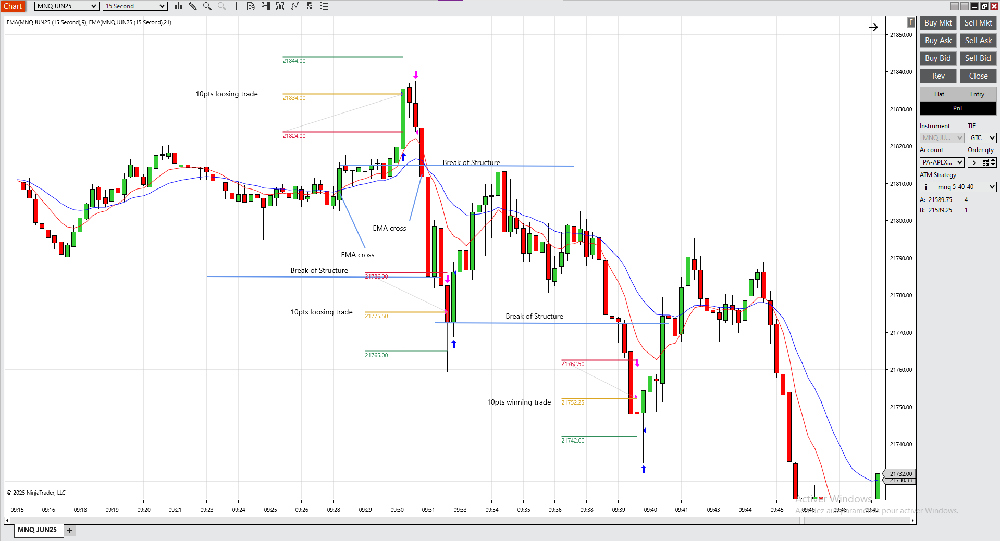
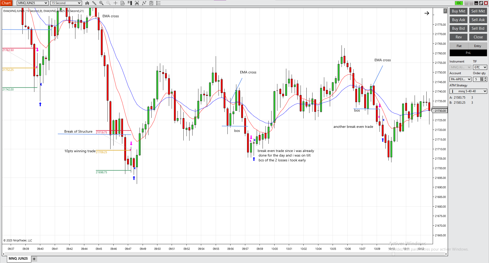
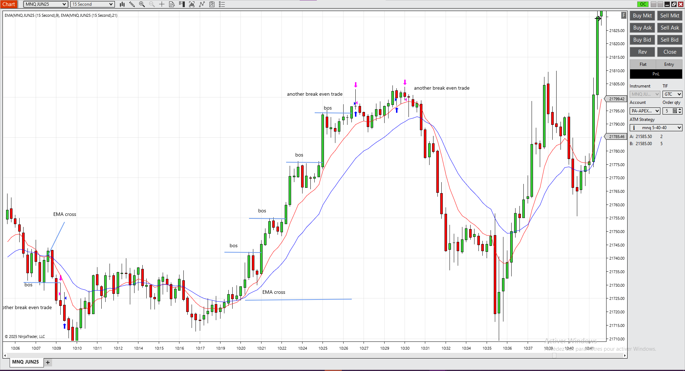
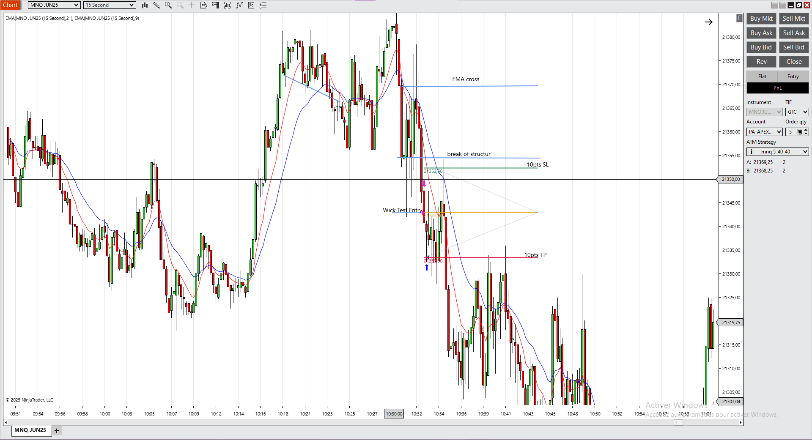

# NQ Momentum Trading Strategy

## The Journey: From Market Confusion to Mathematical Arbitrage

### Chapter 1: The Beginning, Understanding Market Movements

It started with a simple question: **How do markets actually move?** 

Like most traders, I began by staring at charts, trying to decode the seemingly random movements of the Nasdaq futures. After months of studying price action, order flow, and market microstructure, patterns began to emerge. The 15-second NQ charts revealed something most traders miss, micro-momentum signals that predict short-term directional moves with remarkable accuracy.

### Chapter 2: Strategy Discovery, The EMA Cross Momentum System

Through relentless backtesting and live observation, I developed what I now call the **NQ Momentum Scalping Strategy**:

- **Core Setup**: 21 EMA and 9 EMA crossover signals on 15-second charts
- **Entry Trigger**: Break of structure (BoS) followed by pullback entries
- **Risk Management**: Fixed 10-point stop loss and 10-point target (1:1 R:R)
- **Trading Window**: 9:30 AM - 11:00 AM ET (maximum volatility period)

The strategy works because it captures institutional momentum during the most liquid trading hours, riding the wave of large order flows that create predictable short-term trends.

## Chapter 3: Real-World Validation, Prop Firm Challenges

Theory is worthless without execution. I took my strategy to the ultimate test: **proprietary trading firm evaluations**.

### Prop Firm Certifications & Payouts

**TopStep Funded Trader Certification**
- Successfully passed the Trading Combine™
- Achieved funding status: October 30, 2024
- Account Size: $50K Trading Combine
- Status: Consistently profitable funded trader

**Apex Trader Funding Achievements** 
- 50K Account: Funded May 24th, 2024
- 25K Account: Also successfully funded
- Multiple payout confirmations received
- Consistent performance across different account sizes

### Strategy Performance Documentation

The charts tell the story better than words:

**Perfect Execution Examples:**
- Multiple 10-point winners following exact strategy rules
- Clean entries at EMA pullbacks after BoS confirmation
- Risk management discipline maintained throughout

## Chapter 4: The Mathematical Discovery - Prop Firm Arbitrage

While profitable trading was satisfying, my analytical mind discovered something far more interesting: **systematic arbitrage opportunities in prop firm business models**.

### The Research Paper: "Dynamic Risk Arbitrage in Proprietary Trading Firms"

What started as curiosity about prop firm economics became a comprehensive mathematical framework. The paper reveals:

- **Core Finding**: Prop firms charge fees of O(10²) dollars for risk exposures of O(10³) dollars
- **The Asymmetry**: This creates a 10:1 arbitrage opportunity exploitable through dynamic hedging
- **Mathematical Proof**: Complete framework with theorems and proofs for guaranteed profit extraction
- **Universal Application**: Works across any prop firm configuration

[📄 Read the full research paper](research/Dynamic_Risk_Arbitrage_Paper.pdf)

### Mathematical Framework Deep Dive

The paper develops a rigorous mathematical framework starting with fundamental definitions:

**Basic Arbitrage Model:**
- Let A = account size, F = account fee, DD% = drawdown percentage
- Maximum risk exposure: R = A × DD%
- **Theorem 1**: An arbitrage opportunity exists if there exists a coupling function r(t) such that H(T) ≥ F when the account hits drawdown

**Fixed Drawdown Solution:**
For simple drawdown limits, the optimal coupling ratio is:
r* = F/R = F/(A × DD%)
This creates perfect hedge coverage where losses on the primary account generate exactly enough profit on the hedge to recover the account fee.

**Dynamic Coupling for Trailing Drawdowns:**
The most complex scenario involves trailing drawdowns where the floor moves up with account peaks. The paper proves:

**Theorem 2**: For trailing systems, the optimal coupling function is:
r(t) = (T - H(t))/(P(t) - P_floor(t))
Where:
- T = target recovery amount
- H(t) = current hedge balance  
- P(t) = current account balance
- P_floor(t) = current drawdown floor

**Micro-Granular Analysis:**
The paper solves the most challenging case: unit-level price movements with live trailing updates. This creates "partial peak" problems where the account advances partway to a target, then reverses - permanently elevating the drawdown floor without achieving the full target.

**Theorem 3** provides the solution through treating every +1 movement as potentially the final peak, extracting hedge value during upward movement rather than waiting for reversals.

**Universal Feasibility Condition:**
The paper proves that any prop firm configuration (A, F, DD%, M) is arbitrageable if and only if:
F × (M - 1) ≤ A × DD%
Where M is the recovery multiplier target.

### Real-World Case Study: Maven Trading

**Configuration Analysis:**
- Account Size: $10,000
- Fee: $44 (refundable)
- Drawdown: 3%
- Maximum Risk: $300
- Required Efficiency: 14.7%
- Safety Margin: 85.3%

**Profit Analysis:**
Since the fee is refundable, downside risk = $0, while upside potential = $240 (80% of $300 target).
Risk-adjusted ROI = $240/$0 = ∞

This represents a mathematically perfect arbitrage opportunity.

### Key Insights from the Research

The paper mathematically proves that prop firm pricing models contain systematic inefficiencies:
F ≪ R (where F = account fee, R = maximum risk exposure)
Typical ratio: R/F ≈ 10:1 = Arbitrage Opportunity

**Dynamic Implementation Algorithm:**
The paper provides a complete implementation algorithm using real-time coupling adjustments:

1. Initialize with hedge capital equal to account fee
2. Track real-time account peaks and drawdown floors
3. Calculate dynamic coupling ratio based on remaining risk/remaining recovery needed
4. Execute hedge trades opposite to primary account movements
5. Guarantee target achievement regardless of market direction

The mathematics ensure that either:
- **Scenario A**: Account succeeds → Keep trading profits minus hedge costs
- **Scenario B**: Account fails → Hedge profits exactly recover the account fee

This transforms prop firm trading from market speculation into systematic arbitrage extraction.

## Chapter 5: The Complete System - Strategy + Arbitrage

The combination is powerful:

1. **Profitable Base Strategy**: Consistently generates returns through market skill
2. **Arbitrage Framework**: Provides downside protection and additional profit extraction
3. **Systematic Approach**: Transforms prop trading from speculation to mathematical advantage

## The Results: From Student to Systematic Trader

**Financial Performance:**
- Multiple prop firm accounts funded and profitable
- Consistent payout history with documented proof
- Risk-adjusted returns significantly above market benchmarks

**Academic Contribution:**
- Original research published in quantitative finance
- Mathematical framework applicable across the industry
- Bridge between practical trading and academic theory

## Key Learnings

1. **Markets are Mathematical**: Behind the chaos lie exploitable patterns
2. **Edge Comes from Asymmetries**: Find where others misprice risk
3. **Systematic Beats Emotional**: Rule-based approaches outperform intuition
4. **Documentation Matters**: Track everything, question assumptions
5. **Arbitrage > Speculation**: Mathematical advantage beats market prediction

## Disclaimer

This repository is for educational and research purposes. Trading involves substantial risk of loss. The arbitrage strategies discussed require sophisticated risk management and may not be suitable for all traders. Past performance does not guarantee future results.

---

